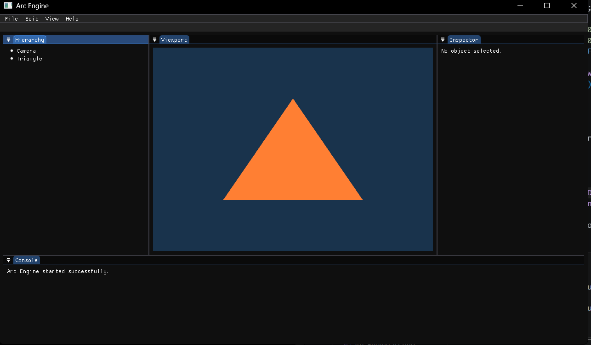

# Arc Engine

<p align="center">
  
</p>

<p align="center">
A custom 2D game engine built from scratch in modern C++ and OpenGL.
</p>

<p align="center">


</p>

---

## About

Arc Engine is a custom game engine built entirely from scratch using modern C++ and OpenGL.

The project began as a way to understand how professional game engines work internally instead of relying on existing engines. Every major subsystem is implemented manually—from rendering and engine architecture to physics, memory management, and editor tools.

The long-term goal is not only to build an engine, but to understand the design decisions behind every system and eventually develop complete games using Arc Engine.

---

## Why Arc Engine?

Most learning projects stop after rendering a triangle.

Arc Engine is different.

The objective is to design an engine that is modular, maintainable, and capable of supporting real-world game development while documenting every major engineering decision along the way.

Future versions of Arc Engine will focus on three core ideas:

- AI-assisted development
- Time Travel Debugging
- Fast Iteration Workflow

---

## Current Features

- OpenGL Renderer
- GLFW Window System
- GLAD Integration
- ImGui Editor
- Docking Support
- Framebuffer Rendering
- Editor Viewport
- Hierarchy Panel
- Inspector Panel
- Console Panel
- Modular Project Structure
- CMake Build System

---

## Planned Features

- Renderer2D
- Camera System
- Texture Rendering
- Sprite Renderer
- Scene Management
- Entity Component System
- Physics Engine
- Animation System
- Audio Engine
- Tilemap Support
- Asset Browser
- Gizmos
- Serialization
- Performance Profiler
- Hot Reloading
- Custom Memory Allocator
- AI Assistant
- Time Travel Debugger

---

# Project Structure

```
Arc-Engine
│
├── Assets/
├── Docs/
├── Engine/
│   ├── Core/
│   ├── Editor/
│   ├── Events/
│   ├── Physics/
│   ├── Renderer/
│   ├── Scene/
│   └── Window/
│
├── Sandbox/
├── ThirdParty/
└── CMakeLists.txt
```

---

# Building the Project

## Requirements

- C++20 Compiler
- CMake 3.20 or newer
- OpenGL 4.6
- Git

Clone the repository:

```bash
git clone https://github.com/yourusername/Arc-Engine.git

cd Arc-Engine
```

Generate build files:

```bash
mkdir build
cd build

cmake ..
```

Build the project:

```bash
cmake --build .
```

Run Sandbox:

```bash
./Sandbox/Sandbox.exe
```

---

# Example

Creating a framebuffer inside Arc Engine:

```cpp
Arc::Framebuffer framebuffer(1280, 720);

framebuffer.Bind();

/* Rendering */

framebuffer.Unbind();
```

Rendering the framebuffer inside the editor viewport:

```cpp
ImGui::Image(
    (ImTextureID)(intptr_t)framebuffer.GetColorAttachment(),
    viewportSize
);
```

---

# Learning Journey

This repository also serves as my personal research notebook.

Every major subsystem is accompanied by notes explaining:

- Why the system exists
- Design decisions
- Mathematical foundations
- Performance considerations
- Implementation details

Topics include:

- Computer Graphics
- Linear Algebra
- Game Engine Architecture
- Physics Simulation
- Memory Management
- Rendering Pipeline
- Data Structures & Algorithms

---

# Roadmap

## Phase 1

- Modern OpenGL
- Engine Core
- Layer System
- Event System
- Editor

## Phase 2

- Renderer2D
- Camera
- Texture System
- Scene Management

## Phase 3

- ECS
- Physics
- Audio
- Asset Management

## Phase 4

- AI Assistant
- Time Travel Debugger
- Performance Profiler

---

# Current Status

Arc Engine is currently under active development.

Recent milestones:

- OpenGL renderer
- ImGui editor
- Dockspace
- Framebuffer rendering
- Editor viewport
- Modular panel system

Next milestone:

- Application Class
- Layer System
- Event System

---

# Contributing

Contributions, suggestions, and bug reports are always welcome.

If you would like to improve Arc Engine, please read the `CONTRIBUTING.md` guide before opening an issue or pull request.

---

# License

This project is licensed under the MIT License.

---

<p align="center">
Built from scratch with C++, OpenGL, and countless hours of experimentation.
</p>
